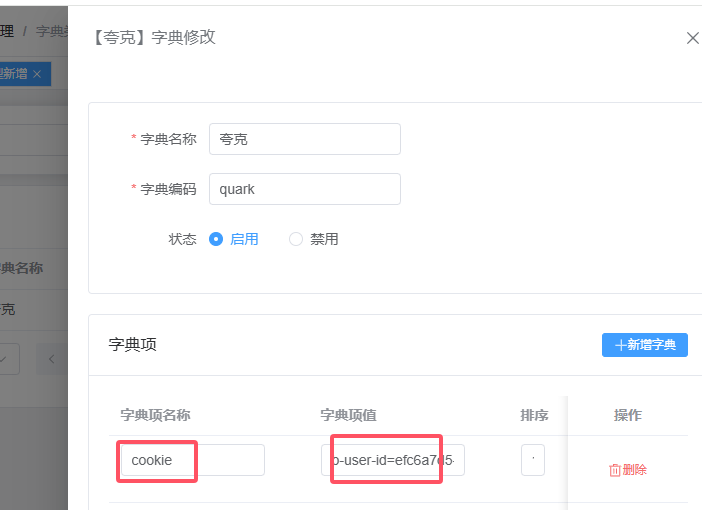
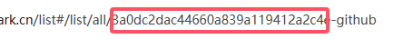
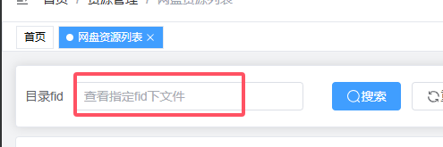
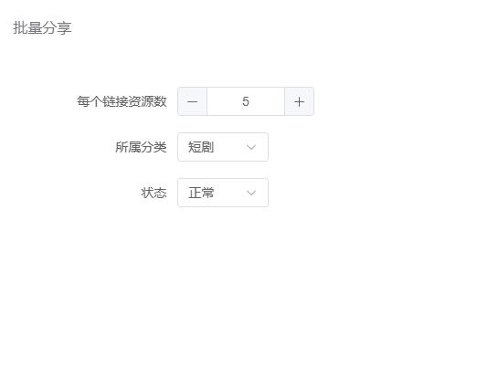

操作入口：资源管理=》资源抓取=》网盘资源列表

1.【重要】字典管理先设置你的夸克网盘cookie,可以从网页版夸克F12 header,复制cookie项的内容

2.登录网页版的夸克，找个你要分享目录，复制这个，这个叫fid，是夸克API用于指定操作目录的

4.1 单个或单页面分享，勾选要分享的文件，填写要存到哪个目录的fid，点击分享

4.2 批量分享，点击【自动批量分享】按钮，填写参数，点确定就会存入搜索栏填fid的目录

成功转存的文件会在 资源管理=》资源列表出现